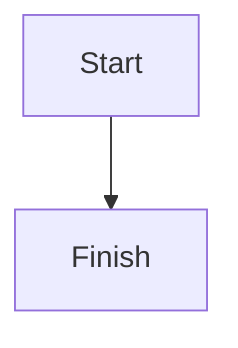

对 `$ARGUMENTS` 进行代码分析，并优先给出可执行、可定位、可验证的结果。

## 输出目标

分析时优先产出以下内容：

1. 关键调用链
2. 模块职责划分
3. 数据结构 / trait / 接口关系
4. 扩展点、注入点、hook 点
5. 关键控制流与状态变化
6. 必要时补充图示

引用代码位置时，优先使用 `file_path:line_number` 格式。

## 分析要求

- 先解释“入口 -> 分发 -> 递归/调用 -> 结果”的主链路，再补细节
- 优先区分：谁负责遍历、谁负责回调、谁持有状态、谁真正完成转换/规划
- 如果涉及 trait / 宏 / derive 代码生成，明确区分：
  - 手写实现
  - 宏展开后隐含生成的实现
  - 运行时真正发生的调用方向
- 如果涉及 visitor / planner / builder 模式，明确说明：
  - 遍历入口
  - 注入点
  - 状态存放位置
  - 是否可变
  - 可否提前中断
- 如果结论依赖代码推断而非直接源码证据，要明确标注“推断”

## 图示规则

记录 DataFusion SQL 到 LogicalPlan 分析流程时，优先使用 fenced `text` 代码块。

### 总图模板

```text
SQL text
  │
  ▼
SessionContext::sql
  │
  ▼
SessionState::create_logical_plan
  │
  ├─ sql_to_statement
  │    └─ DFParserBuilder / DFParser
  │         - 文本 -> DataFusion AST Statement
  │         - 处理 dialect / recursion limit
  │         - 支持 DataFusion 自定义 SQL 语法
  │
  └─ statement_to_plan
       │
       ├─ resolve_table_references
       ├─ 构造 SessionContextProvider
       │    - 表
       │    - UDF/UDAF/UDWF
       │    - ExprPlanner / RelationPlanner / TypePlanner
       │    - options / variables
       │
       └─ SqlToRel::statement_to_plan
            │
            ├─ statement.rs   顶层语句分发
            ├─ query.rs       WITH / ORDER BY / LIMIT / pipe operators
            ├─ select.rs      FROM / WHERE / GROUP BY / HAVING / QUALIFY / window
            ├─ relation/*     relation / join / subquery / table factor
            └─ expr/*         SQL Expr -> datafusion Expr
                     │
                     ▼
               LogicalPlanBuilder + 直接构造 LogicalPlan 节点
                     │
                     ▼
               unoptimized LogicalPlan
```

### 调用链图模板

```text
SessionContext::sql
  -> SessionContext::sql_with_options
  -> SessionState::create_logical_plan
  -> SessionState::sql_to_statement
  -> DFParserBuilder / DFParser
  -> Statement
  -> SessionState::statement_to_plan
       -> resolve_table_references
       -> SessionContextProvider
       -> SqlToRel::statement_to_plan
            -> sql_statement_to_plan
            -> query_to_plan
                 -> select_to_plan / set_expr_to_plan
                      -> plan_from_tables
                      -> create_relation
                      -> sql_to_expr
                      -> LogicalPlanBuilder
  -> LogicalPlan
```

### 内部模块协作图模板

```text
SqlToRel
  │
  ├─ statement.rs
  │    - 顶层 Statement 分发
  │    - Query / Explain / DDL / DML / Set / Reset
  │
  ├─ query.rs
  │    - Query 级别包装
  │    - WITH / ORDER BY / LIMIT / pipe operators
  │
  ├─ select.rs
  │    - SELECT 主体
  │    - FROM / WHERE / projection / GROUP BY / HAVING / window / QUALIFY / DISTINCT
  │
  ├─ relation/mod.rs
  │    - table factor 规划
  │    - 表 / 子查询 / CTE / UNNEST / table function
  │    - RelationPlanner 扩展入口
  │
  ├─ relation/join.rs
  │    - join 规划
  │    - ON / USING / NATURAL / CROSS JOIN
  │
  └─ expr/*
       - SQL Expr -> Expr
       - 函数 / 聚合 / window / order by / 子查询表达式
       - ExprPlanner 扩展入口
```

## Mermaid 转 ASCII 规则

当输出 Mermaid 图时，必须额外附上一份 ASCII 字符画版本，不能只给 Mermaid。

输出顺序必须是：

1. fenced `mermaid` 代码块
2. fenced `text` 代码块，对应 ASCII 字符画

示例：



```text
+-------+     +--------+
| Start | --> | Finish |
+-------+     +--------+
```

### Mermaid 生成要求

- 优先使用本地 `mermaid-ascii` 工具生成 ASCII 字符画
- 默认使用 ASCII 模式：`mermaid-ascii --ascii`
- Mermaid 内容一旦修改，ASCII 字符画也必须重新生成
- 不要手写或伪造 ASCII 渲染结果
- 如果本地无法生成 ASCII，必须明确说明原因，不能假装已生成

### 本地工具约定

优先使用以下脚本：

```bash
bash ~/.claude/skills/omc-learned/mermaid-ascii-companion/scripts/render-mermaid-ascii.sh /tmp/diagram.mmd
```

如需临时生成 Mermaid 文件，可使用：

```bash
cat > /tmp/diagram.mmd <<'EOF'
graph TD
    A[Client] --> B[API]
    B --> C[(DB)]
EOF

bash ~/.claude/skills/omc-learned/mermaid-ascii-companion/scripts/render-mermaid-ascii.sh /tmp/diagram.mmd
```

## 回答风格

- 先给结论，再给调用链和证据
- 解释复杂调用时，优先用“谁调用谁”而不是只贴 trait 定义
- 优先回答“为什么会调用到这里”而不是只回答“在哪里定义”
- 需要时把复杂逻辑降成接近真实执行的伪代码
- 图示和文字都应服务于理解调用方向、模块边界和状态流转