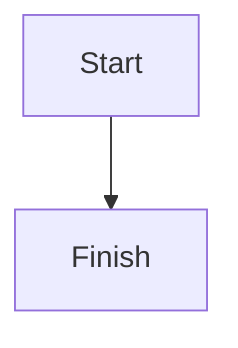

在最终回答包含 Mermaid 图时，必须额外附上一份由 `mermaid-ascii` 二进制工具生成的 ASCII 字符画。

## 何时使用

当你准备输出以下任意内容时，使用本 skill：

- `mermaid`
- flowchart / graph TD / graph LR
- sequenceDiagram
- stateDiagram
- classDiagram
- erDiagram
- gantt
- journey
- 任何需要架构图、流程图、调用链图的 Mermaid 输出

如果最终不会输出 Mermaid，则不要使用本 skill。

## 输出契约

最终回答包含 Mermaid 时，输出顺序必须是：

1. fenced `mermaid` 代码块
2. fenced `text` 代码块，对应 ASCII 字符画

不要只输出 Mermaid，不要伪造 ASCII 渲染结果。

示例：



```text
+-------+     +--------+
| Start | --> | Finish |
+-------+     +--------+
```

## Mermaid 生成要求

- 优先使用本地 `mermaid-ascii` 二进制工具
- 默认使用 ASCII 模式：`mermaid-ascii --ascii`
- Mermaid 内容一旦修改，ASCII 字符画也必须重新生成
- 不要手写或伪造 ASCII 渲染结果
- 如果本地无法生成 ASCII，必须明确说明原因，不能假装已生成

## 安装方式

先检查工具是否可用：

```bash
mermaid-ascii --help
```

如果未安装，可参考上游仓库：

- 仓库：`https://github.com/AlexanderGrooff/mermaid-ascii`

示例安装方式：

```bash
# 方式 1：下载 release 二进制
curl -s https://api.github.com/repos/AlexanderGrooff/mermaid-ascii/releases/latest \
  | grep "browser_download_url.*mermaid-ascii" \
  | grep "$(uname)_$(uname -m)" \
  | cut -d: -f2,3 \
  | tr -d '\"' \
  | wget -qi -
tar xvzf mermaid-ascii_*.tar.gz

# 方式 2：从源码构建
git clone https://github.com/AlexanderGrooff/mermaid-ascii.git
cd mermaid-ascii
go build
```

## 使用示例

直接从文件渲染：

```bash
mermaid-ascii --ascii -f /tmp/diagram.mmd
```

标准输入方式：

```bash
cat /tmp/diagram.mmd | mermaid-ascii --ascii
```

临时生成 Mermaid 文件并渲染：

```bash
cat > /tmp/diagram.mmd <<'EOF'
graph TD
    A[Client] --> B[API]
    B --> C[(DB)]
EOF

mermaid-ascii --ascii -f /tmp/diagram.mmd
```

## 执行要求

1. 先写 Mermaid 源码。
2. 使用 `mermaid-ascii --ascii` 实际渲染 ASCII。
3. 渲染成功后，再把 Mermaid 与 ASCII 一起放进最终回答。
4. 如果渲染失败，明确说明失败原因；除非用户接受降级，否则不要只给 Mermaid。
